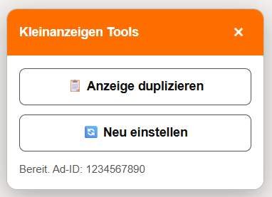

# 🛠️ Kleinanzeigen Tools

A Tampermonkey userscript that adds a compact control panel to the Kleinanzeigen edit-listing page. It provides actions to duplicate an ad or attempt to relist it.


> [!WARNING]
> **Use this script entirely at your own risk.** Kleinanzeigen is a third-party service. This is an unofficial, independent project and is not affiliated with, endorsed by, or supported by Kleinanzeigen.

> [!CAUTION]
> The script interacts with undocumented website behavior and endpoints that can change at any time. It may fail, create incorrect or duplicate listings, delete listings, or otherwise cause unintended results.
>
> You are solely responsible for reviewing the source code, testing it safely, and for every action performed with this script. The author and contributors accept no liability for data loss, deleted listings, account restrictions, financial loss, or any other direct or indirect damage resulting from its use.

## Features

| Action | Description |
|---|---|
| 📋 **Anzeige duplizieren** | Creates a new listing from the values currently present in the edit form. |
| 🔄 **Neu einstellen** | Attempts to delete the original listing and create a replacement listing. |
| 🪟 **Floating panel** | Adds a panel in the lower-right corner rather than relying on Kleinanzeigen UI classes or save-button placement. |
| 🔎 **Status messages** | Displays the detected ad ID plus success and error messages directly in the panel. |

## Screenshot

The userscript displays a **Kleinanzeigen Tools** panel at the bottom-right of the edit page.



The floating panel is deliberate: the Kleinanzeigen interface is React-based and may change its button classes, hierarchy, or page layout at any time.

## Requirements

- A supported desktop browser:
  - Google Chrome
  - Microsoft Edge
  - Mozilla Firefox
  - Vivaldi
- The [Tampermonkey](https://www.tampermonkey.net/) browser extension
- An active, logged-in Kleinanzeigen account
- An existing ad opened in edit mode

Tampermonkey injects scripts according to the metadata block; `@run-at document-idle` runs after the document’s `DOMContentLoaded` event. See [Tampermonkey documentation](https://www.tampermonkey.net/documentation.php?locale=en&q=run_at).

## Installation

### Option A – Direct install (recommended)

1. Install [Tampermonkey](https://www.tampermonkey.net/) in your browser.
2. Click this direct-install link:  
   [`https://raw.githubusercontent.com/mdjdev/kleinanzeigen-tools/main/kleinanzeigen-tools.user.js`](https://raw.githubusercontent.com/mdjdev/kleinanzeigen-tools/main/kleinanzeigen-tools.user.js)
3. Tampermonkey will prompt you to install the script.
4. Confirm the installation and ensure the script is enabled in the dashboard.

### Option B – Manual install

1. Install [Tampermonkey](https://www.tampermonkey.net/) in your browser.
2. Open the Tampermonkey dashboard.
3. Select **Create a new script**.
4. Remove the generated template.
5. Paste the full contents of [`kleinanzeigen-tools.user.js`](kleinanzeigen-tools.user.js).
6. Save the script with `Ctrl` + `S`.
7. Ensure that the script is enabled in the Tampermonkey dashboard.

The script is intentionally limited to Kleinanzeigen edit pages:

```js
// @match https://www.kleinanzeigen.de/p-anzeige-bearbeiten.html*
```

## Usage

1. Log in at [kleinanzeigen.de](https://www.kleinanzeigen.de).
2. Open **Meins** / **Meine Anzeigen**.
3. Select one of your own listings.
4. Click **Bearbeiten**.
5. Wait until the page has loaded.
6. Look for the **Kleinanzeigen Tools** panel at the lower-right of the page.
7. Choose one of the available actions.

### Duplicate an ad

1. Open the listing in edit mode.
2. Optionally adjust the form values before creating the duplicate.
3. Click **📋 Anzeige duplizieren**.
4. Wait for the success status and automatic redirect.

The original listing remains unchanged.

### Relist an ad

1. Open the listing in edit mode.
2. Click **🔄 Neu einstellen**.
3. Confirm the warning dialog.
4. The script first tries to delete the original listing.
5. It then attempts to submit the current form as a new listing.

> [!CAUTION]
> **Neu einstellen** may delete the original listing. Use this only if you understand and accept the risk of losing the original ad.

## Contributing

Issues and pull requests are welcome.

For bug reports, include a concise description of the problem and sanitized console output. Do not include account credentials, cookies, access tokens, or private listing data.

## License

This project is licensed under the [GNU General Public License v3.0](LICENSE).

## Credits

This repository originated as a fork of the [Kleinanzeigen duplicate-script project by RIPENCE](https://github.com/RIPENCE/Kleinanzeigen_Duplicate_Script) and earlier contributors.